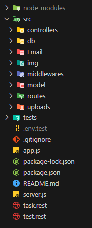

- [Introdução](#introducao)
- [Casa](#casa)

# Introdução

API-authentication é um projeto desenvolvido em função da necessidade de se aplicar conhecimentos adquiridos em estudos
da linguagem **javascript** no lado do servidor em projetos reais. Criado com diversos pacotes publicos disponiveis no NPM, esse projeto dispoe de diversas funcionalidades como **sign-up**, **login** e entre outras. Essa documentação foi criada no intuito de servir como uma anotação para consultas futuras, de modo que todo o conteúdo apresentado aqui será o mais completo e detalhado possível.

# Estrutura do projeto

# Passos iniciais

Para
