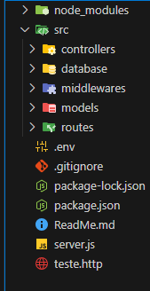
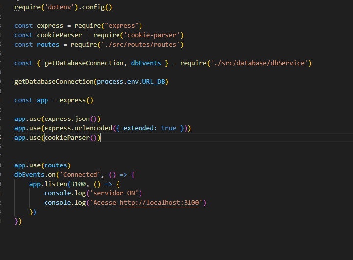
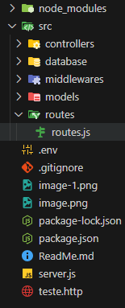

# Passos para criação do sistema de autenticação

## 1. Instalar depencias e criar arquivos

```bash
PS C:\Users\Igor\Desktop\revisar> npm i express validator jsonwebtoken nodemon --save-dev dotenv argon2 cookie-parser
```

## 2. Criar pastas



## 3. Configurar servidor



## 4. Criar o arquivo routes



Dentro dele fazemos
